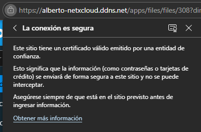
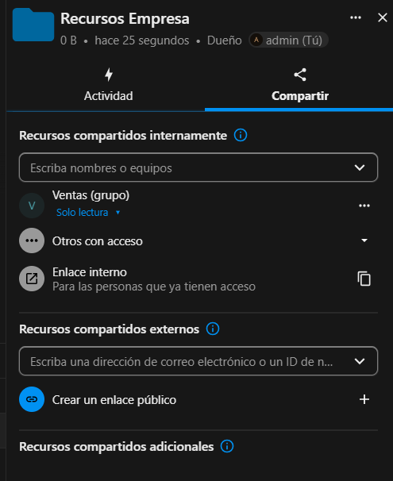
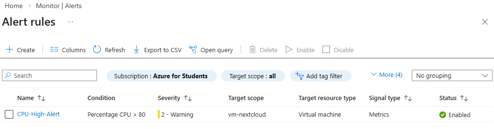

# ☁️ Enterprise Nextcloud Deployment on Azure (AZ-104 Lab)

## 📌 Project Overview
This project demonstrates the automated deployment and configuration of a self-hosted **Nextcloud** private cloud environment on **Microsoft Azure**. The architecture is designed with a focus on security, identity management, and infrastructure-as-code (IaC) principles, aligning with the core competencies of the **AZ-104 Microsoft Azure Administrator** certification.

## 🏗️ Architecture & Azure Components Used
- **Compute:** Ubuntu 22.04 VM (`Standard_B4s_v2`) running Docker.
- **Networking:** Virtual Network (VNet), custom Subnet, and a statically assigned Public IP.
- **Security (NSG):** Network Security Group configured with strict inbound rules (Ports 80/443 public, Ports 22/8080 restricted to admin IP).
- **Identity & Secrets (Key Vault):** System-assigned Managed Identity for the VM to securely retrieve the Nextcloud Admin password from Azure Key Vault without hardcoded credentials.
- **Monitoring:** Azure Monitor Alert Rules configured to track CPU spikes (>80%).
- **Application Layer:** Nextcloud All-in-One (AIO) via Docker, Caddy Reverse Proxy, and automated SSL/TLS via Let's Encrypt (HTTP-01 challenge).
- **Storage:** Azure Blob Storage (provisioned for scalable external data layer).


## 🚀 Deployment Automation (Azure CLI)
Instead of manual portal configuration, the entire base infrastructure was deployed using a Bash script with Azure CLI to ensure reproducibility.

<details>
<summary><b>Click to view the Deployment Script</b></summary>

```bash
#!/bin/bash
set -e

# Variables
RG="rg-nextcloud-lab"
LOCATION="swedencentral"
VNET="vnet-nextcloud"
SUBNET="snet-app"
NSG="nsg-nextcloud"
IP="ip-nextcloud"
VM="vm-nextcloud"
KV="kv-nextcloud-lab"
MY_IP="[REDACTED_ADMIN_IP]"

echo "=== Creating Resource Group ==="
az group create --name $RG --location $LOCATION

echo "=== Creating NSG & Security Rules ==="
az network nsg create --resource-group $RG --name $NSG --location $LOCATION
az network nsg rule create --resource-group $RG --nsg-name $NSG --name Allow-SSH --priority 100 --source-address-prefixes $MY_IP --destination-port-ranges 22 --protocol Tcp --access Allow --direction Inbound
az network nsg rule create --resource-group $RG --nsg-name $NSG --name Allow-HTTP --priority 110 --source-address-prefixes '*' --destination-port-ranges 80 --protocol Tcp --access Allow --direction Inbound
az network nsg rule create --resource-group $RG --nsg-name $NSG --name Allow-HTTPS --priority 120 --source-address-prefixes '*' --destination-port-ranges 443 --protocol Tcp --access Allow --direction Inbound
az network nsg rule create --resource-group $RG --nsg-name $NSG --name Allow-AIO --priority 130 --source-address-prefixes $MY_IP --destination-port-ranges 8080 --protocol Tcp --access Allow --direction Inbound

echo "=== Creating VNet & Subnet ==="
az network vnet create --resource-group $RG --name $VNET --location $LOCATION --address-prefix 10.0.0.0/16 --subnet-name $SUBNET --subnet-prefix 10.0.1.0/24 --network-security-group $NSG

echo "=== Creating Public IP ==="
az network public-ip create --resource-group $RG --name $IP --location $LOCATION --sku Standard --allocation-method Static

echo "=== Provisioning Virtual Machine (with Managed Identity) ==="
az vm create --resource-group $RG --name $VM --location $LOCATION --image Ubuntu2204 --size Standard_B4s_v2 --admin-username azureuser --generate-ssh-keys --vnet-name $VNET --subnet $SUBNET --nsg $NSG --public-ip-address $IP --public-ip-sku Standard --os-disk-size-gb 64 --assign-identity

echo "=== Creating Azure Key Vault ==="
az keyvault create --resource-group $RG --name $KV --location $LOCATION --enable-rbac-authorization false
```
</details>

## 📸 Proof of Concept & Execution

### 1. Cloud Infrastructure & Security (Azure)
The environment is securely restricted. Only HTTP/HTTPS is open to the world, while management ports (SSH/AIO Panel) are locked to the administrator's IP.

**Resource Group & VM Properties:**


**Network Security Group (Firewall Rules):**


### 2. Application Layer (Docker & Nextcloud AIO)
Evidence of microservices deployment (Apache, Postgres, Redis) and the final "Running" status of the containers via the AIO panel.


### 3. Secrets Management (Azure Key Vault)
Leveraging System-assigned Managed Identity to securely retrieve administrator credentials from Azure Key Vault, eliminating hardcoded secrets.


### 4. Application Security (SSL/TLS)
Valid SSL/TLS certificate automatically issued by Let's Encrypt via Caddy reverse proxy.



### 5. Identity and Access Management (Nextcloud IAM)
Created separate departments (Sales, Support) with specific users and applied Principle of Least Privilege (PoLP) by sharing folders with "Read-Only" permissions.




### 6. CLI Administration (OCC Tool)
Used Docker exec and Nextcloud's `occ` command-line tool to query user lists directly from the container backend.


### 7. Monitoring & Operations
Azure Monitor Alert Rule configured to trigger a notification if the VM CPU exceeds 80%.


